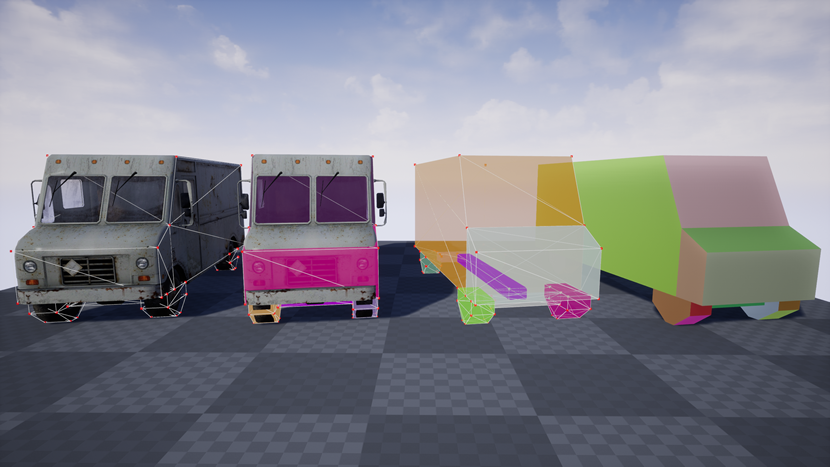

# COD4 .map planes to UE collision shape

### Notes
- COD4's inches converted to cm.

### TODO
- Parse planes from .map file rather than manually creating them in the code.
- CSG union to remove inner faces
  - https://github.com/stefanha/map-files/blob/f28e6a33b41e8748990e092f2878add5c1922cb8/brush.cpp#L34
- Calculate UVs 
  - https://github.com/KILLTUBE/corvid/blob/v2/Formats%2FBaseMap%2FFace.py#L129
	
### Special Thanks
- https://github.com/myuce/mapviewer (My code is based on Mehmet Yüce's code. Thx for help!)
- https://github.com/xoxor4d/iw3xo-dev (devgui helped me a lot to get into COD4)

### References
 - https://github.com/stefanha/map-files/blob/master/MAPFiles.pdf
 - https://quakewiki.org/wiki/Quake_Map_Format